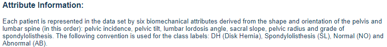

# MANE 4333

## Homework 8 MLPClassifiers and SVMClassifiers

### Assigned: November 15, 2024
### Due: November 25, 2024

Use the Vertebral Column Data Set from the UCI Machine Learning Repository that was used for Homework Assignments 6 and 7. This data set contains 6 attributes that are used to determine the state of a person's spine. Each person's spine is labelled as DH, SL, NO or AB.

The column names for the data set (taken from the UCI Machine Learning Repository) are provided below.

#### Problem 1

Use the RandomizedSearchCV algorithm with the MLPClassifier to develop a model to classify the state of a person's spine. Display the parameters of the best MLPClassifier model, the accuracy of the best model for the training and test sets, and the confusion matrices for the training and testing data sets.

#### Problem 2

Fit a SVM Linear Classifier model to the data. Display the accuracy of the model for the training and test sets, and the confuion matrices for the training and testing data sets.

#### Problem 3

Use the GridSearchCV algorithm to find the best SVM Classifier with a RBF kernel. Display the parameters of the best MLPClassifier model, the accuracy of the best model for the training and test sets, and the confusion matrices for the training and testing data sets.

#### Problem 4

State which model from Problems 1-3 provides the bet fit to the data and support your conclusion with facts from the three problems.
